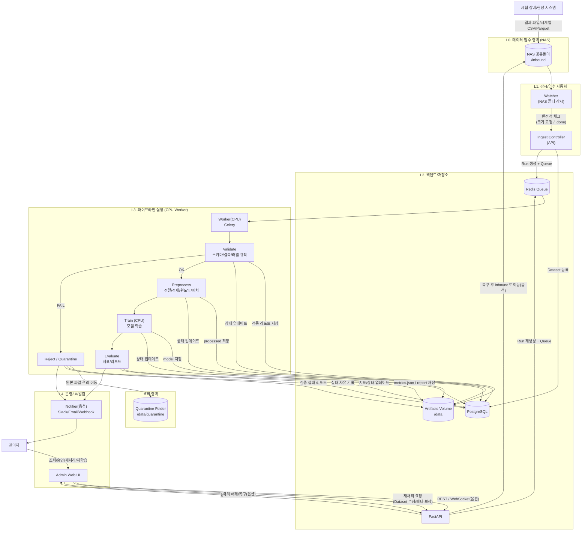

# Workflow Diagram

```mermaid
flowchart TB
 subgraph L0["L0. 데이터 입수 영역 (NAS)"]
        NAS[("NAS 공유폴더<br>/inbound")]
  end
 subgraph L1["L1. 감시/입수 자동화"]
        W["Watcher<br>(NAS 폴더 감시)"]
        IC["Ingest Controller<br>(API)"]
  end
 subgraph L2["L2. 백엔드/저장소"]
        API["FastAPI"]
        DB[("PostgreSQL")]
        Q[("Redis Queue")]
        AR[("Artifacts Volume<br>/data")]
  end
 subgraph L3["L3. 파이프라인 실행 (CPU Worker)"]
        C["Worker(CPU)<br>Celery"]
        S1["Validate<br>스키마/결측/라벨 규칙"]
        S2["Preprocess<br>정렬/정제/윈도잉/피처"]
        S3["Train (CPU)<br>모델 학습"]
        S4["Evaluate<br>지표/리포트"]
        F1["Reject / Quarantine"]
  end
 subgraph L4["L4. 운영/UI/알림"]
        WEB["Admin Web UI"]
        N["Notifier(옵션)<br>Slack/Email/Webhook"]
  end
 subgraph LQ["격리 영역"]
        QDIR[("Quarantine Folder<br>/data/quarantine")]
  end
    A["시험 장비/현장 시스템"] -- 결과 파일/시계열 CSV/Parquet --> NAS
    NAS --> W
    W -- "완전성 체크<br>(크기 고정 / .done)" --> IC
    U["관리자"] -- 조회/승인/재처리/재학습 --> WEB
    WEB -- REST / WebSocket(옵션) --> API
    API -- 상태/로그/지표 제공 --> WEB
    IC -- Dataset 등록 --> DB
    IC -- Run 생성 + Queue --> Q
    Q --> C
    C --> S1
    S1 -- 검증 리포트 저장 --> AR
    S1 -- 상태 업데이트 --> DB
    S1 -- OK --> S2
    S1 -- FAIL --> F1
    S2 -- processed 저장 --> AR
    S2 -- 상태 업데이트 --> DB
    S2 --> S3
    S3 -- model 저장 --> AR
    S3 -- 상태 업데이트 --> DB
    S3 --> S4
    S4 -- "metrics.json / report 저장" --> AR
    S4 -- 지표/상태 업데이트 --> DB
    S4 --> N
    N --> U
    F1 -- 원본 파일 격리 이동 --> QDIR
    F1 -- 실패 사유 기록 --> DB
    F1 -- 검증 실패 리포트 --> AR
    F1 --> N
    WEB -- 재처리 요청<br>(Dataset 수정/메타 보정) --> API
    API -- Run 재생성 + Queue --> Q
    WEB -- 격리 해제/복구(옵션) --> API
    API -- 복구 후 inbound로 이동(옵션) --> NAS
```
